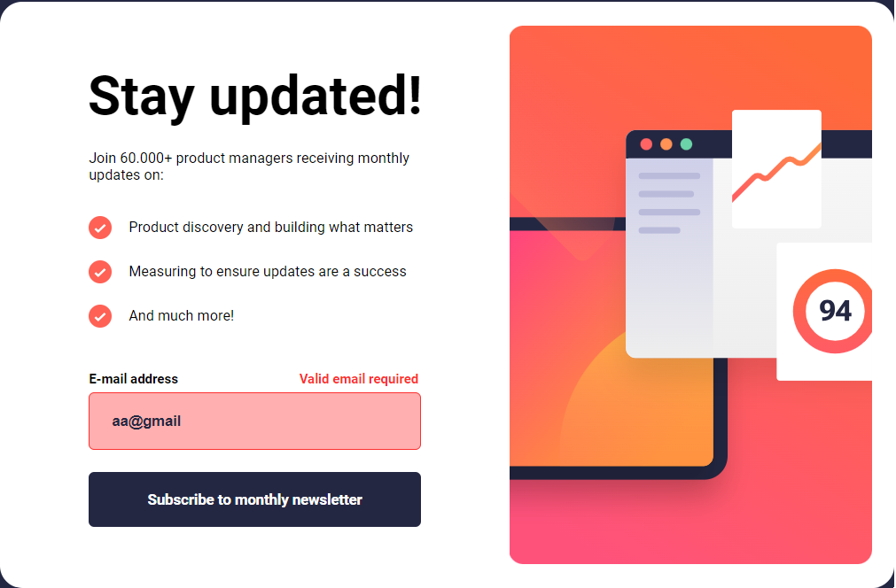

# Frontend Mentor - Newsletter sign-up form with success message

 

Built with HTML, CSS and JavaScript.

## Sumary

- [Overview](#overview)
    - [The Challenge](#the-challenge)
    - [Screenshot](#screenshot)
- [My Process](#my-process)
    - [Built With](#built-with)
    - [What I Learned](#what-i-learned)
- [Updates](#updates)
    - [1st Update](#1st-update)
    - [2nd Update](#2nd-update)
    - [3rd Update](#3rd-update)
    - [4th Update](#4th-update)

## Overview

### The Challenge

- Add their email and submit the form
- See a success message with their email after successfully submitting the form
- See form validation messages if:
  - The field is left empty
  - The email address is not formatted correctly
- View the optimal layout for the interface depending on their device's screen size
- See hover and focus states for all interactive elements on the page

### Screenshot

## My Process

### Built With

- Semantic HTML5 markup
- CSS custom properties
- Flexbox
- Javascript

### What I Learned

- 'Onblur' Attribute
- 'Tabindex' Attribute
- Manipule HTML with JavaScript
- Manipule CSS with JavaScript
- Modal
- Validate an input with JavaScript
- 'Oisabled' Attribute 
- 'Oninput' Attribute
- Regex
- 'Match' Function
- 'Keypress' Event
- Keycode value
- Form.reset()
- window.event

## Updates

### 1st Update
08/24/23

- I wrote all the HTML5 structure
    - Heading
    - Description
    - List
    - Input
    - Span (error message)
    - Button
    - Image section
- Wrote the CSS (max-width: 1366px)
    - main-content
        - ...
        - alert span
- Validate input and active button
    - if the input is empty
    - if the email address is not formatted correctly
    - active 'Subscribe' button

    
    
    

### 2nd Update
08/26/23

- Built the Modal
    - Created the static modal "pop-up"
    - Stylized the modal

    
    

### 3rd Update
08/27/23

- Fixed the script
    - it had some problems with the buttons' logic
- Dynamic project
    - Transforming the email on a variable to show when modal shows up

    
    
    
    
    
    
    

### 4th Update
08/29/23

- Responsiveness
    - Breakpoint width: 809px
    - Mobile
- Real-time validation
    - Keeps validating the email while the user keep the input on focus
    - By using 'oninput' attribute
- Submit by pressing 'Enter'
- When click on 'Dismiss message'
    - Reset form
    - Reload the page (before that, when press 'Enter' after 'Dismiss message', it was reopening the modal)
- When pressing 'Escape'
    - close modal
    - reset form
    - refresh page

    
    
    
    
    

The project is finished!
